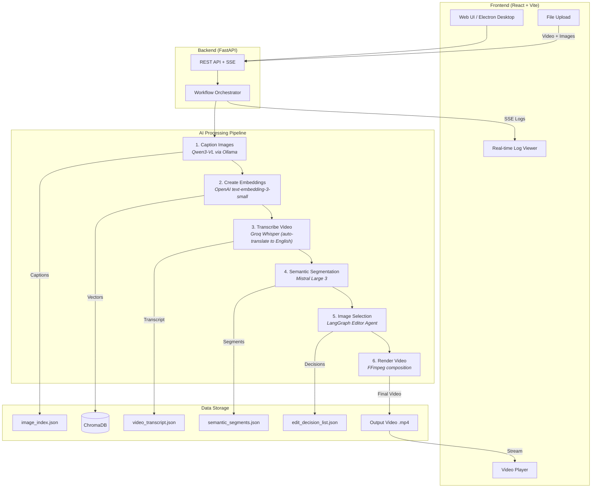
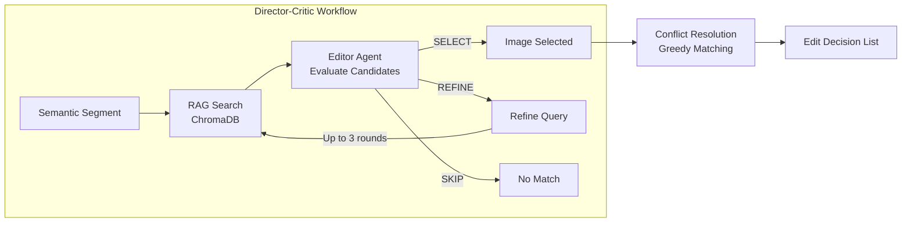

# Humanitarian Video Editor

An AI-powered documentary video editor that automatically selects and overlays B-roll images onto video timelines based on transcript content. Built for **El Seibo Mission's** work documenting life in the Bateyes (Haitian sugarcane workers' settlements) of the Dominican Republic.

Upload a source video and a collection of images — the system transcribes, analyzes, and intelligently matches images to relevant segments, then renders a final illustrated documentary.

---

## Architecture



---

## LangGraph Agent Flow



---

## Project Structure

```
humanitarian-video-editor/
├── backend/                  # FastAPI server
│   ├── api/
│   │   ├── routes.py         # API endpoints
│   │   └── workflow.py       # Workflow orchestration
│   ├── services/
│   │   ├── caption.py        # Image captioning service
│   │   └── logging.py        # SSE log streaming
│   └── main.py               # Server entry point
│
├── src/                      # Core AI processing
│   ├── agents.py             # LangGraph agent definitions
│   ├── create_segments.py    # Semantic segmentation
│   ├── director_graph.py     # Director-Critic workflow
│   ├── index_images.py       # Image captioning with Ollama
│   ├── paths.py              # Portable path management
│   ├── rag.py                # ChromaDB vector search
│   ├── render_video.py       # FFmpeg video composition
│   └── transcribe.py         # Groq Whisper transcription
│
├── frontend/                 # React 19 + Vite
│   └── src/
│       ├── App.jsx           # Main application
│       └── components/
│           ├── FileUpload.jsx
│           ├── WorkflowControl.jsx
│           ├── LogViewer.jsx
│           ├── VideoPlayer.jsx
│           └── Settings.jsx
│
├── desktop/                  # Electron desktop app
│   ├── main/                 # Electron main process
│   ├── preload/              # Preload scripts
│   └── bundle_backend.py     # PyInstaller bundling
│
├── prompts/                  # AI system prompts
│   ├── editor_agent_prompt.md
│   ├── segment_consolidator_prompt.md
│   └── vision_agent_prompt.md
│
└── requirements.txt
```

---

## Getting Started

### Prerequisites

- Python 3.12+
- Node.js 18+
- FFmpeg (bundled via `imageio-ffmpeg`)

### API Keys Required

Create a `.env` file in the project root:

```env
GROQ_API_KEY=your_groq_key          # Whisper transcription
OPENAI_API_KEY=your_openai_key      # Text embeddings
OLLAMA_API_KEY=your_ollama_key      # Image captioning
OLLAMA_HOST=https://your-ollama-host
```

### Installation

```bash
# Backend
pip install -r requirements.txt

# Frontend
cd frontend && npm install
```

### Running (Development)

```bash
# Terminal 1 - Backend (localhost:8000)
python -m backend.main

# Terminal 2 - Frontend (localhost:5173)
cd frontend && npm run dev
```

Open `http://localhost:5173` in your browser.

### Building Desktop App

```bash
# 1. Build frontend
cd frontend && npm run build

# 2. Copy to desktop renderer
cp -r frontend/dist/* desktop/renderer/

# 3. Bundle backend with PyInstaller
python desktop/bundle_backend.py

# 4. Package Electron app
cd desktop && npm run pack
```

The packaged app will be in `desktop/dist/win-unpacked/`.

---

## How It Works

1. **Upload** a source video and a collection of B-roll images
2. **Caption** - AI vision model (Qwen3-VL) describes each image
3. **Embed** - Descriptions are vectorized and stored in ChromaDB
4. **Transcribe** - Groq Whisper translates audio to English text
5. **Segment** - LLM groups transcript into narrative segments
6. **Select** - LangGraph agent matches images to segments using RAG search
7. **Render** - FFmpeg composites selected images onto the video timeline

---

## API Endpoints

| Method | Endpoint | Description |
|--------|----------|-------------|
| `POST` | `/api/upload/video` | Upload source video |
| `POST` | `/api/upload/images` | Upload B-roll images |
| `GET` | `/api/images` | List images with caption status |
| `POST` | `/api/workflow/start` | Start processing pipeline |
| `POST` | `/api/workflow/cancel` | Stop running workflow |
| `POST` | `/api/workflow/reset` | Reset project (keeps captions) |
| `GET` | `/api/workflow/status` | Poll workflow state |
| `GET` | `/api/workflow/logs` | SSE real-time log stream |
| `GET` | `/api/output/video` | Get output video info |
| `GET` | `/api/output/download/:file` | Download rendered video |

---

## Tech Stack

| Layer | Technology |
|-------|-----------|
| Frontend | React 19, Vite |
| Backend | FastAPI, Uvicorn |
| Desktop | Electron, PyInstaller |
| Vision AI | Qwen3-VL (Ollama) |
| Transcription | Groq Whisper Large V3 |
| Segmentation | Mistral Large 3 |
| Image Selection | LangGraph, LangChain |
| Vector DB | ChromaDB + OpenAI Embeddings |
| Video Rendering | FFmpeg |

---

## License

Private project - All rights reserved.
